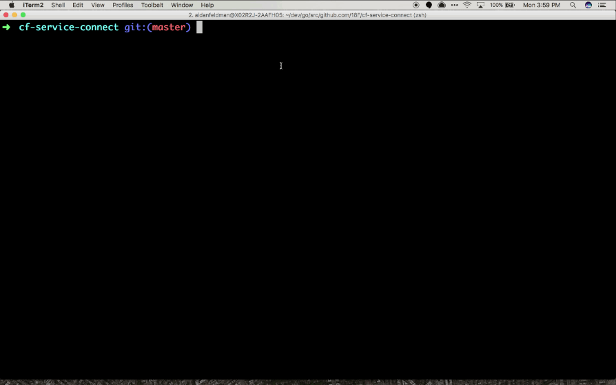

# Cloud Foundry CLI Service Connection Plugin [](https://travis-ci.org/18F/cf-service-connect) [](https://codeclimate.com/github/18F/cf-service-connect)

This plugin makes it easy to connect to your databases or other Cloud Foundry service instances from your local machine. This condenses the steps listed in [Accessing Services with SSH](https://docs.cloudfoundry.org/devguide/deploy-apps/ssh-services.html) to a single command.



Requires Diego architecture with [SSH enabled](https://docs.cloudfoundry.org/running/config-ssh.html).

## Support

Currently supports (most) service brokers for the following:

* MongoDB (requires `mongo` Shell)
* MySQL (requires `mysql` CLI)
* PostgreSQL (requires `psql` CLI)
* Redis (requires `redis-cli`)

## Local installation

1. Install the Cloud Foundry CLI v6.15.0 or later.
1. Install the plugin, using the appropriate binary URL from [the Releases page](https://github.com/18F/cf-service-connect/releases).

    ```sh
    cf install-plugin <binary_url>
    # will be of the format
    # https://github.com/18F/cf-service-connect/releases/download/<version>/cf-service-connect.<os>
    ```

1. Install CLI corresponding to the service type (see above).

## Usage

* `app_name` is the name of the app in your space you want to tunnel through.
* `service_instance_name` is the service instance you wish to connect to.

```
$ cf target --organization <org> --space <space>
$ cf connect-to-service <app_name> <service_instance_name>
Finding the service instance details...
Setting up SSH tunnel...
...
mysql>
```

### Manual client connection

If you're using a non-default client (such as a GUI), run with the `-no-client` option to set up your client connection on your own.
